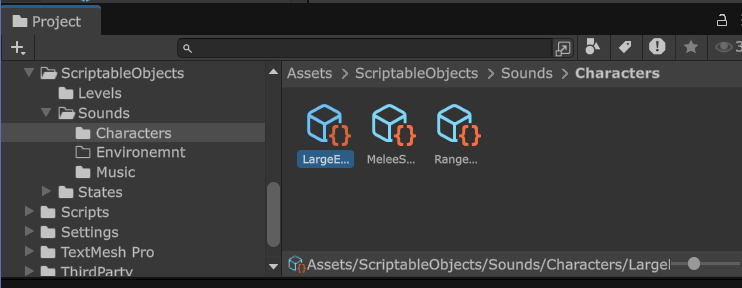
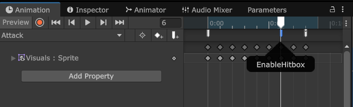
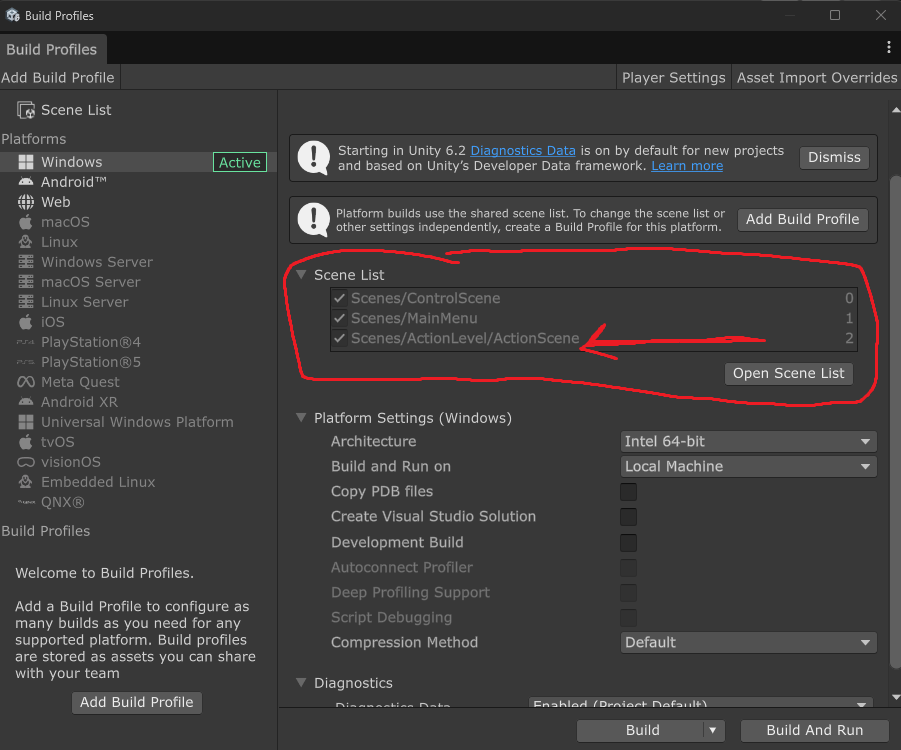
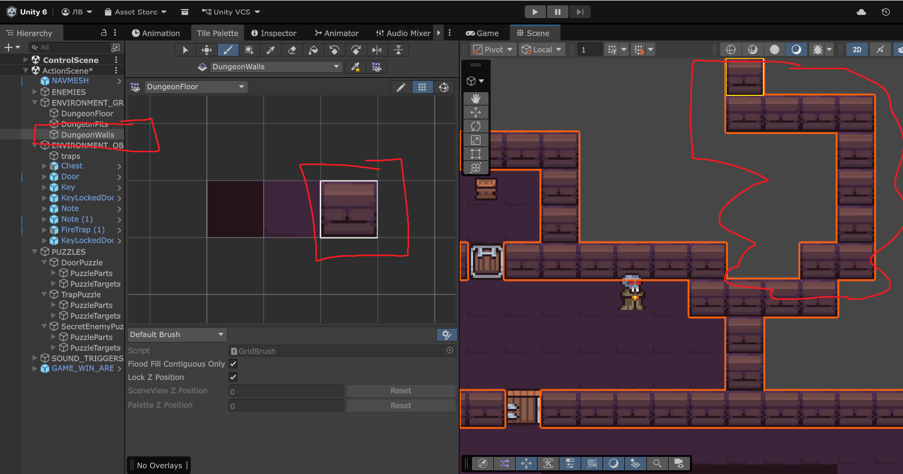
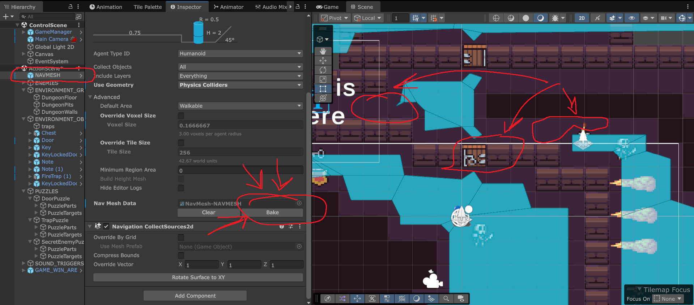
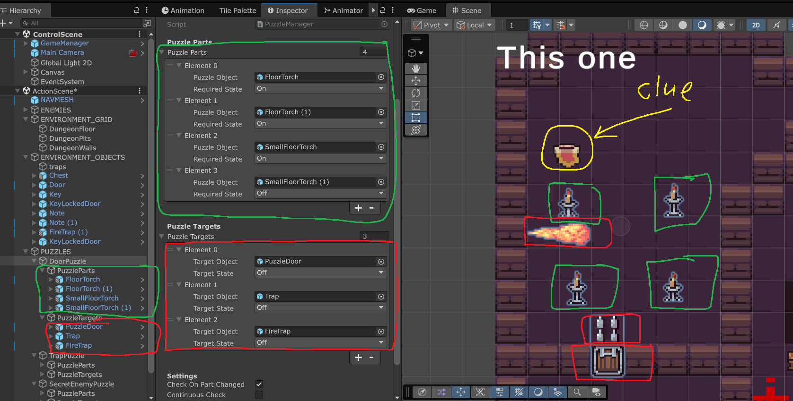
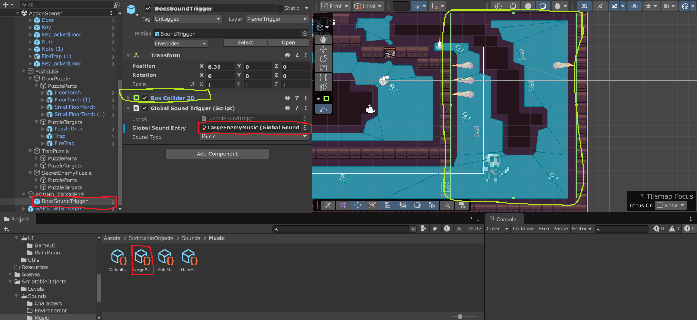
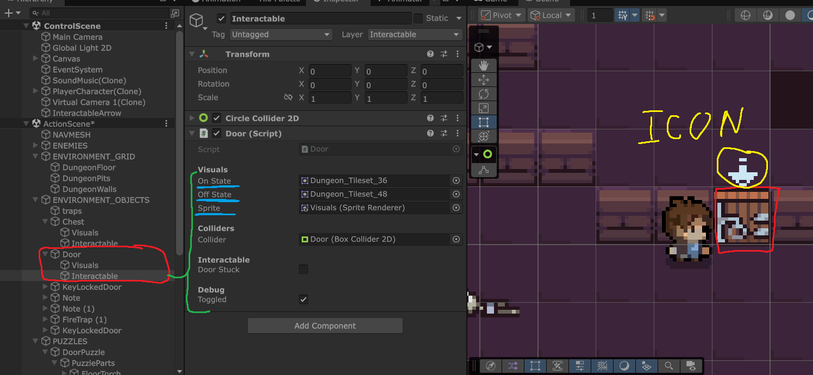

# Проект: 2D Top-Down Game с головоломками и боевой системой

## Обзор проекта
Этот проект - готовый шаблон для создания 2D top-down уровней. Ваша задача:
- Использовать готовые префабы и системы (звуков, головоломок, врагов с навигацией в пространстве) для создания уровней.
- Заменить базовый визуал на свой (спрайты, анимации).
- Расставить объекты на сцене для достижения игровой цели.

---

# Оглавление

- [Проект: 2D Top-Down Game с головоломками и боевой системой](#проект-2d-top-down-game-с-головоломками-и-боевой-системой)
  - [Обзор проекта](#обзор-проекта)
  - [Структура проекта](#структура-проекта)
    - [Важные замечания](#важные-замечания)
    - [Управление игроком](#управление-игроком)
    - [Сцены](#сцены)
    - [Дизайн уровней](#дизайн-уровней)
      - [Tilemap и NavMesh](#tilemap-и-navmesh)
      - [Головоломки (Puzzles)](#головоломки-puzzles)
      - [Звуки (SoundTriggers)](#звуки-soundtriggers)
    - [Префабы](#префабы)
      - [Characters (Персонажи)](#characters-персонажи)
      - [Interactable (Взаимодействуемые объекты)](#interactable-взаимодействуемые-объекты)
      - [Traps (Ловушки)](#traps-ловушки)
      - [Projectiles (Снаряды)](#projectiles-снаряды)
    - [Звук (Sound)](#звук-sound)
    - [UI](#ui)
    - [Утилиты (Utils)](#утилиты-utils)
  - [Важные замечания](#важные-замечания-1)
  - [Дополнительные материалы](#дополнительные-материалы)
  - [Сообщение о багах и ваши предложения (Issues)](#сообщение-о-багах-и-ваши-предложения-issues)

## Структура проекта

### Важные замечния

Для упрощения редактирования были использованы ScriptableObjects для описания уровня, хранения звуков для персонажей и музыки и для описания состояний противников. Их удалать не стоит, так как придется производить настройку заново

 

Персонажи и ловушки, которые имеют анимации, зависимы от триггер ивентов внутри аниматора, поэтому для изменения анимации стоит либо удалять именно кадры аниматора и заменять их своими или создавать полностью новый аниматор, но добавлять туда все ивенты, как в оригинальном. 

 

### Управление игроком

| Кнопка | Действие |
|--------|----------|
| WASD | Перемещение |
| F | Атака |
| E | Взаимодействие |
| Tab | Переключение между объектами |

При наведении на интерактивный объект появляется иконка. Нажимайте Tab для переключения между объектами в зоне. Управление сделано на основе New Input System, так что там еще какие-то бинды есть в Input Actions, но вы уже большие, сами разберетесь.

### Сцены
1. **`ControlScene`**:
   - **Назначение**: Главная сцена для управления игровым процессом. **Всегда должна быть первой загружаемой сценой**.
   - **Что делать**:
     - Открыть сцену `ControlScene` и сделать её **активной**.
     - Здесь находится **`PlayerSpawnPosition`** внутри GameManager, который определяет, где появится игрок в `ActionScene`.

2. **`ActionScene`**:
   - **Назначение**: Основная игровая сцена, где происходит действие.
   - **Структура**:
     - **`Environment`**: Контейнер с **Tilemap** (пол, ямы, стены).
     - **`Enemies`**: Контейнер для врагов (просто для организации сцены).
     - **`EnvironmentObjects`**: Статические и динамические объекты окружения.
     - **`Puzzles`**: Контейнер для головоломок (каждый дочерний объект - отдельная головоломка; эта структура не обязательна, но рекомендуется).
     - **`SoundTriggers`**: Зоны с триггерами для воспроизведения звуков (музыка, эффекты).
     - **`GameWinArea`**: Префаб зоны победы (просто нужно до нее дойти).

   - **Как создать новый уровень**:
     1. Скопируйте `ActionScene` и переименуйте её.
     2. Измените LevelData, чтобы он ссылался на вашу новую сцену (ScriptableObjects/Levels). 
     3. В Build Settings замените ActionScene на вашу только что созданную.
     4. Измените **Tilemap**, **объекты** и **головоломки** под свои нужды.
     5. **Важно**: После изменения **Tilemap** или добавления **статических объектов** (например, сундуков, факелов) **перестройте NavMesh**.

     > 
```
ActionScene
├── NavMesh                   # Навигация врагов
│   └── NavMeshSurface        # Компонент навигации
├── Environment               # Тайлеры уровня
│   ├── Floor                 # Пол (проходимый)
│   ├── DungeonPit            # Ямы (проходимо, видно)
│   └── DungeonWall           # Стены (непроходимо)
├── Environment Objects       # Объекты уровня
├── Puzzles                   # Головоломки
├── Sound Triggers            # Триггеры звука
├── Game Win Area             # Зона победы
└── Enemies                   # Враги
```

---

### Дизайн уровней

#### Tilemap и NavMesh
- **Tilemap**:
  - **`Floor`**: Проходимая область (игрок и враги могут ходить).
  - **`DungeonPit`**: Непроходимая область, но **пули и взгляд врагов проходят сквозь неё**.
  - **`DungeonWalls`**: Непроходимая область. **Пули разрушаются**, а враги **не видят игрока** сквозь стены.
  - **Tile Rules**: Настроены для быстрого создания плиток, но **не обязательны** к использованию. Основной набор плиток уже добавлен в **Tile Palette** (Window > 2D > Tile Palette).

  > 
  > *Откройте **Tile Palette** (Window → 2D → Tile Palette), выберите тайл и нарисуйте её на нужном слое (Floor, DungeonPit, DungeonWalls).*

| Тайлмап | Проходимость | Видимость игрока для врагов, проходимость проджектайлов |
|---------|--------------|------------|
| Floor | Да | Да |
| DungeonPit | Нет | Да |
| DungeonWall | Нет | Нет |

- **NavMesh**:
  - **Перестраивайте NavMesh** после изменения **Tilemap** или добавления **статических объектов** (стены, препятствия).
  - Враги **не могут ходить сквозь объекты шириной в 1 плитку** (дизайнерское решение для баланса).

    > *Navmesh построена так, что противники не могут проходит в проходах шириной в одну клетку (чизить врагов в узких проходах не люблю, пи№!#ц)*
    > 
---

#### Головоломки (Puzzles)
- **Структура**:
  - Каждый дочерний объект в контейнере `Puzzles` - отдельная головоломка. Примеры элементов в пазлах будут ниже в Interactables.
    - PuzzleParts - то, что игрок должен поменять для решения паззла
    - PuzzleTargets - то, что изменит состояние при выполнении паззла. Если условие перестанет выполняться, то PuzzleTargets вернется в исходное состояние, когда он еще не был решен. 
  - **Примеры**:
    - **Дверь с факелами**: Игрок должен зажечь нужные факелы (подсказка в заметке рядом) `DoorPuzzle`.
    - **Ловушки как часть головоломки**: В `TrapPuzzle` ловушки активируются/деактивируются при взаимодействии с факелом.
- **Взаимодействие с врагами**:
  - Враги могут быть частью головоломок. Например, после смерти врага открывается дверь `SecretEnemyPuzzle`.
  - **Возрождение врагов** через головоломки **не реуализовано**, если вы попросите, то возможно будет.

    > 
---

#### Звуки (SoundTriggers)
- **Структура**:
  - Зоны с `TriggerEnter2D`, которые воспроизводят звуки при входе игрока.
  - **Типы звуков**:
    - **Одноразовые эффекты** (например, звук разбитого стекла).
    - **Музыкальные треки** (заменяют основную музыку, пока игрок в зоне).
        - В папке ScriptableObjects/Sounds/Music содержится базовая музыка, которая используется в меню, базовый эмбиент и так далее. Рекомендуется менять именно их для изменения музыки в меню
- **Настройка**:
  - Создайте **ScriptableObject** для звука (Right click - create - game audio - global sound ).
  - Прикрепите его к зоне `SoundTrigger`.
  - **Важно**: После выхода из зоны восстанавливается **основная музыка** (настроена в `SoundData`).

    > 
---

### Префабы

#### Characters (Персонажи)
- **Структура**:
  - `Player`: Игрок с аниматором, коллайдерами и логикой управления.
  - `NPC/Enemy`: Враги с **State Machine**, аниматорами и логикой атаки.
- **Анимации**:
  - **Меlee атаки**: Только горизонтальные (влево/вправо), несмотря на top-down вид.
  - **Ranged атаки**: В любом направлении (только у врагов).
  - **Важно**:
    - Анимации содержат **Animation Events** (например, `AttackStarted`, `FireProjectile`).
    - **Не меняйте события** в анимациях, иначе логика сломается.
    - Чтобы изменить **визуал**, замените спрайты в `Visuals` или анимации в `Animator`.
    - **Prefabs как варианты**: Изменения в базовом префабе (`BaseCharacter`) повлияют на все вараианты, не стоит его удалять.

    > 
---

#### Interactable (Взаимодействуемые объекты)
- **Структура**:
  - **Physical**: Объекты, которые игрок может **толкать** (ключ, зелье).
  - **Static**: Непередвигаемые объекты (например, двери, сундуки).
    - **Chest**: Можно изменить лут, который с него падает.
    - **Door**: Открывается при взаимодействии.
    - **FloorTorch**: Переключаемый факел (используется в головоломках).
    - **KeyLockedDoor**: Становится взаимодействуемым, если у игрока есть ключ.
    - **Note**: Отображает текст при взаимодействии.
    - **PuzzleLockedDoor**: Открывается только при решении головоломки.

    > 

| Объект | Описание | Может быть в головоломке |
|-------|----------|---------------------------|
| FloorTorch | Факел (вкл/выкл) | Да |
| Chest | Сундук с лутом | Нет |
| Door | Простая дверь | Нет |
| KeyLockedDoor | Дверь открывается ключом | Нет |
| PuzzleDoor | Дверь головоломки | Да |
| Note | Записка с текстом | Нет |
| SmallFloorTorch | Уменьшенный факел | Да |


| Объект | Описание |
|--------|----------|
| Potion | Зелье здоровья |
| Key | Ключ для открытия двери |

---

#### Traps (Ловушки)
- **Структура**:
  - Ловушки могут быть частью головоломок (например, активируются/деактивируются факелом).
  - **Анимации**: Содержат **Animation Events** для включения/выключения хитбоксов.

---

#### Projectiles (Снаряды)
- **Структура**:
  - Единственный префаб для **дальнобойной атаки врага**.
  - **Анимацию** можно изменить через `Animator`.

---

### Звук (Sound)
- **`SoundTrigger`**: Универсальный префаб для воспроизведения звуков в зоне. Был описан выше.
- **Система звука**: Не трогайте папку `System` (содержит базовую логику).

---

### UI
- **Меню и HUD**: Можно изменять **шрифты**, **фон**, **кнопки** для единого стиля.
- **Заголовки и текст**: Легко модифицируются для обновления дизайна.

---

### Утилиты (Utils)
- **`PlayerSpawnPosition`**:
  - Находится в `ControlScene`, но определяет позицию игрока в `ActionScene`.
  - **Важно**: Перемещайте его в `ControlScene`.

---

## Важные замечания
1. **NavMesh**:
   - **Всегда перестраивайте** после изменения Tilemap или добавления статических объектов.

2. **Анимации**:
   - **Не меняйте названия Animation Events** (например, `AttackStarted`, `FireProjectile`).
   - Для изменения визуала заменяйте **спрайты** в анимациях, но сохраняйте события, или настраивайте аниматор с нуля.

3. **Prefabs**:
   - Многие префабы являются **вариантами** (Prefabs Variants). Изменения в базовом префабе повлияют на все его варианты.

4. **Головоломки**:
   - Враги могут быть частью головоломок (например, их смерть открывает дверь).
   - Факелы могут использоваться для динамического переключения ловушек (см. `TrapPuzzle` в основной сцене). Можно использовать для заманивания врагов

5. **Звуки**:
   - Для новых звуковых зон создайте **ScriptableObject** и прикрепите его к `SoundTrigger`.


---

## Дополнительные материалы
- **Документация по реализации**: См. папку `Docs/Implementation` для деталей по коду и логике (автоматически сгенерировано, я не сильно проверял. Подходит для базового ознакомления с кодом системам, если вам интересно).
- **Примеры головоломок**: См. `PUZZLES` в ActionScene сцене для взаимодействия ловушек, факелов, врагов и дверей.

## Сообщение о багах и ваши предложения (Issues)
Если у вас есть предложения или были обнаружены баги, создавайте в репозитории Issue. Буду стараться на них отвечать.

### Примеры Issue

**Плохо (Сурово - разраб вообще офигел и не понял, че далать. Но зато честно):**
```
Персонажу игрока в игре ультра впадлу ходить и вообще реагировать на мои действия. Разраб бездарность
```

**Хорошо (Часть с бездарностью можете перенести из прошлого примера, чтобы было честно):**
```
Ошибка при прыжке
При прыжке в узких проходах персонаж застревает
Шаги воспроизведения:
1. Запустить игру
2. Войти в первую комнату
3. Прыгнуть влево в узкий проход
Ожидаемое поведение: персонаж прыгает дальше
Фактическое: персонаж застревает

(Разраб бездарность)
```


